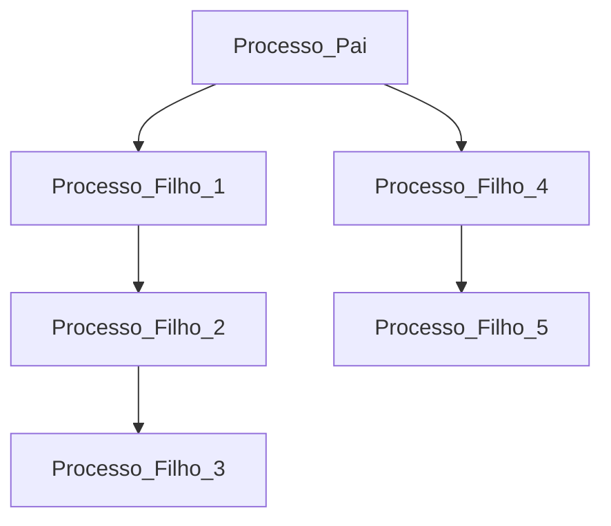

# Exercícios

## 1 – Crie um programa com dois processos. As medidas de um terreno retangular devem ser lidas. O processo Filho deve calcular a área do terreno e o processo Pai o perímetro. Todos os resultados obtidos devem ser mostrados ao usuário.
#### Resolução

## 2 – Escreva um programa formado por 3 processos concorrentes, que executam um laço de repetição de N interações. Neste laço, cada processo imprime sua identificação. A partir da execução do programa, identifique como acontece o escalonamento dos processos.
#### Resolução

## 3 – Faça um programa em que dois processos concorrentes executam as ações a seguir. Lembre-se de imprimir o PID– de cada processo em cada impressão.
* Processo Pai:
  *Imprime os números de 1 a 50, com um intervalo de 2 segundos entre cadanúmero.Quadro 1 – Exemplo de uso da função gettimeofday
  * Ao terminar, imprime “Processo Pai finalizou”.
* Processo Filho1:
  * Imprime os números de 100 a 200, com um intervalo de 1 segundo entre cada um.
  * Ao terminar, imprime “Filho1 finalizou”.
* Processo Filho2:
  * Imprime os números de 250 a 350, com um intervalo de 1 segundo entre cada um.
  * Ao terminar, imprime “Filho2 finalizou”.
* Verifique como acontece o escalonamento de processos na execução do exercício 3.
#### Resolução

## 4 – Desenvolva um algoritmo para criar os processos conforme a árvore de processos:
#### Resolução

## 5 – Desenvolva um algoritmo para efetuar a soma dos dois vetores e mostrar o vetor resultante, com mais de um processo para efetuar a soma dos vetores;

### Quadro 1 – Exemplo de uso da função gettimeofday
```cpp
#include <sys/time.h>
...
struct timeval tpI, tpF;
int sec, usec
...
gettimeofday(&tpI,NULL);
//processamento
gettimeofday(&tpF, NULL);
sec = tpF.tv_sec - tpI.tv_sec;
usec = tpF.tv_usec - tpI.tv_usec;
if (usec<0){
usec += 1000000L;
sec -= 1;
}
printf("tempo: %d s %d us\n", sec, usec);
```
### A) Efetue a medida do tempo de execução deste programa, usando a funçãogettimeofday, conforme o quadro 1. Compare os resultados obtidos, variando a quantidade de processos. Qual das execuções apresentou melhor desempenho?
#### Resolução

### B) Neste problema, existiu acesso concorrente aos dados pelos diferentes fluxos de execução?
#### Resolução
